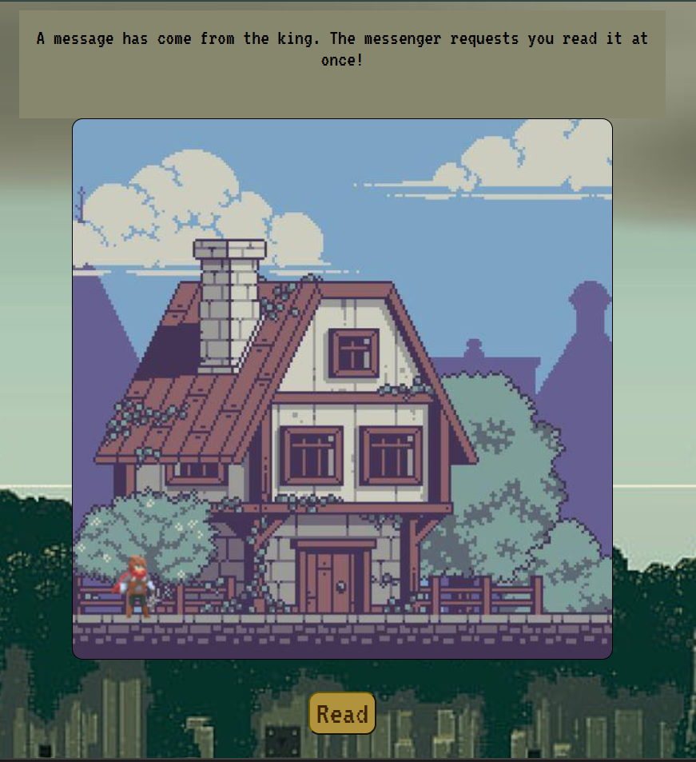
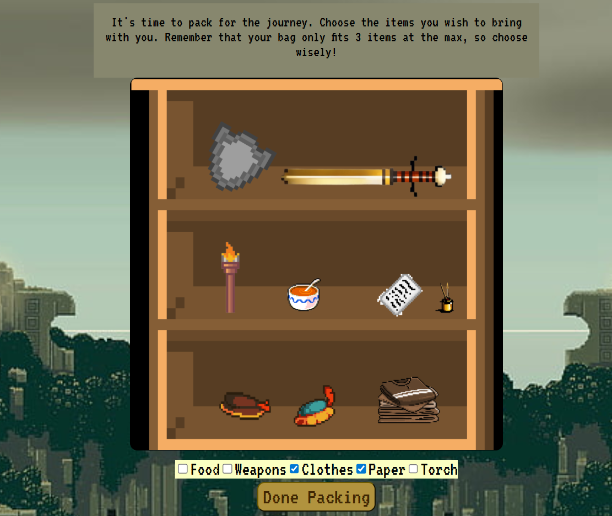
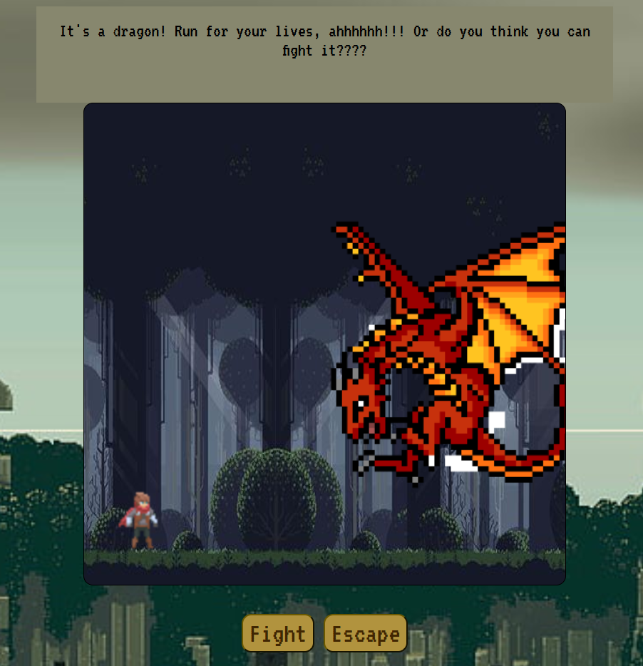

# Age of Adventure
A choose-your-own-adventure web-based video game built using HTML, CSS, and JavaScript. With an 8-bit theme accompanied by sound effects and simple storyline, this game provides a unique experience for each user based on their decisions at various stages throughout.

Key gameplay components:
* Progression of storyline driven by user decisions
* Character animations, scrolling background, and sound effects
* Resetting of global variables for a seamless transition to replay

This game was originally developed in Replit with a partner as a high school computer science course final project. This game is fully functional, however not all details of features (such as advanced character movement) were fully fleshed out. Graphics  were either custom-made or from loyalty free image packages.

Check out some frames from the gameplay below!

 

